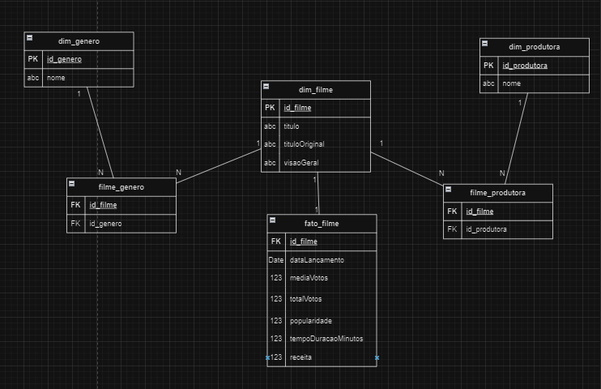
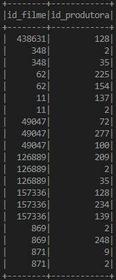
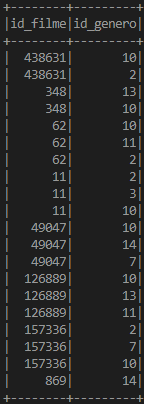
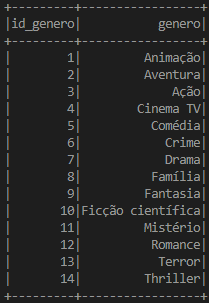
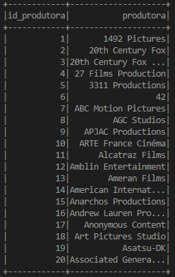
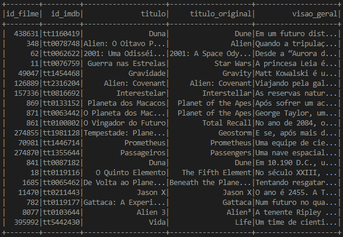
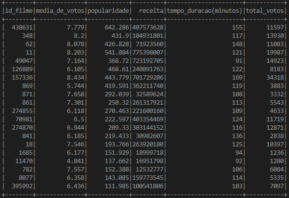

# Processo de extração de Dados

Para o nosso processo de extração Usamos como base de dados o site [The Movie DB](https://www.themoviedb.org), fazendo uso de sua API.

## Explicação da análise

Bom escolhi o tema de filmes relacionados ao espaço, ao total foram 600+ filmes sobre esse tema, como explicado acima, busquei cada filme a partir do id, defini a linguagem como português(&language=pt-BR&) limitando a busca apenas pelo gêneros de minha escolha: Ficção Científica(id=878), ordenei por popularidade(&sort_by=popularity.desc), também incluí algumas palavras chaves(with_keywords=234007|9882|305|12185|14626|3801|4040|1432|2345) em sequência: nave espacial, space, moon, moon base, astronaut, space travel, space mission e spaceman, retirei a palavra-chave super hero(&without_keywords=318450), pois, estavam aparecendo alguns filmes de super herói, por mais que faça um pouco parte do meu tema, esse não era meu objetivo, e retirei algumas companias(without_companies=420|574|5822), com o objetivo de também tirar filmes indesejados da lista.

## Explicação de cada passo do [código](../extracao/script_tmdb/tmdbScript.py) que faz uso da API do tmdb

Primeiramente peguei os ids dos filmes do meu tema usando o discover, depois disso usei os ids pra fazer uma consulta mais detalhada usando o details, onde a pesquisa é feita por ID e os armazenei, depois dividi os dados dos filmes para que tenham apenas 100 registros por arquivo, depois formatei eles afim de facilitar a manipulação e visiblidade dos arquivos, por fim, salvei os arquivos JSON em um [diretório](../extracao/json/) de minha escolha.

# Camada Trusted

A camada "Trusted" do meu código é a parte onde eu irei tratar os dados e eliminar qualquer filme que possua dados indesejados, deixando apenas aqueles filmes que terão utilidade no futuro.

## Explicando o [código da Trusted](../transformacao/trusted/processamentoTrusted.py)

Usando o [pyspark](https://spark.apache.org/docs/latest/api/python/index.html), primeiro começo pegando o nome dos meus arquivos que possuem os filmes(Resultantes da requisição a API do TMDB), depois transformo cada arquivo JSON em um dataframe usando o spark, depois disso eu concateno todos os Dataframes em um único Dataframe, aí então eu faço minha filtragem, retiro todos os filmes onde o "id_imdb" seja igual a nulo, retiro todos os filmes que a coluna "receita" seja igual a 0 e retiro todos os filmes que a coluna "total_votos" seja igual a 0, pois, sem esses dados a minha análise seria vaga, depois salvo o arquivo JSON com os filmes que sobraram(120)

# Camada Refined

Nesta etapa, os dados são transformados em formatos mais adequados para análises avançadas e tomadas de decisão, nesta camada, você encontrará dados que foram tratados e enriquecidos, estando prontos para serem consumidos por aplicações externas

## Explicando o [código da Refined](../transformacao/refined/processamentoRefined.py)

Também usando [pyspark](https://spark.apache.org/docs/latest/api/python/index.html), começo transformando o arquivo JSON resultante da camada Trusted em um data frame, e aqui nessa camada, meu objetivo é tratar esses dados para que possam ser usados em aplicações externas, então vou modelar esses dados de uma [forma multidimensional](imagens/modelagem_multidimensional.png), e criar tabelas que facilitarão a leitura por essas aplicações externas, começo "explodindo" a coluna "generos", fazendo com que cada gênero se torne uma linha separada, crio uma janela ordenada pelo genero e adiciono uma coluna "id_genero" contendo um número sequencial único para cada gênero, depois crio a dimesão "dim_genero" que contem o gênero e um id para cada gênero. Faço o mesmo processo com a coluna "produtoras", que resulta na dimensão chamada "dim_produtora" que contem a produtora e um id para cada produtora, após isso, eu crio uma dimensão filme("dim_filme") com as colunas: "id_filme", "id_imdb", "titulo", "titulo_original", "visao_geral". E crio uma última tabela chamada "fato_filme" que contém as colunas: "id_filme", "media_de_votos", "popularidade", "receita", "tempo_duracao(minutos)", "total_votos". Também crio mais duas tabela chamadas: "filme_genero" e "filme_produtora" onde realiza um join entre o dataframe original e a dimensão de gênero/produtora para obter os IDs correspondentes. Feito isso nós poderiamos ter criado arquivos JSON, parquet,etc para facilitar a exportação desses dados, mas como foi apenas para exemplificação eu imprimi essas tabelas no terminal, a seguir, mostro a modelagem multidimensional e em seguida cada tabela imprimida no terminal:

## Modelagem multidimensional

### OBS: Tabelas aparecem apenas as 20 primeiras linhas
### Dimensão Gênero

### Dimesão Produtora

### Filme Gênero

### Filme Produtora

### Dimensão Filme

### Fato Filme

